# DBS302
## Practical 3 Report: Design and Implementation of an E-Commerce Platform Schema in MongoDB with Aggregation Framework and Query Performance Optimization

| Field              | Details                                                        |
|--------------------|----------------------------------------------------------------|
| **Submitted By**   | Tandin Zangmo                                                  |

## Table of Contents

1. [Aim](#1-aim)
2. [Objectives](#2-objectives)
3. [Theory](#3-theory)
4. [Schema Design](#4-schema-design)
5. [Implementation](#5-implementation)
6. [Aggregation Framework Queries](#6-aggregation-framework-queries)
7. [Index Creation and Query Optimization](#7-index-creation-and-query-optimization)
8. [Discussion and Observations](#8-discussion-and-observations)
9. [Conclusion](#10-conclusion)

## 1. Aim

The aim of this practical is to design and implement a realistic e-commerce platform schema using MongoDB to demonstrate the use of the aggregation framework for analytical querying and apply indexing strategies with query analysis techniques to achieve a measurable performance optimization in a document-oriented database environment.

## 2. Objectives

What we will achieve at the end of the practical :

- To design a realistic model of e-commerce domain which will have users, products, orders and categories by using MongoDB's document-oriented data model and schema design.
- To implement schema into MongoDB collections with sample data.
- To build a complex aggregation pipelines for analytics use cases which mainly includes daily revenue reporting, top product ranking, per-customer order statistics and catalog views.
- To create and configure indexes like compound, text and multikey that is aligned with the application's most critical query patterns.
- To employ `explain("executionStats")` to confirm that indexes are being used, and to measure the performance gains from query optimization.

## 3. Theory

### 3.1 MongoDB Data Modeling

MongoDB is a document store NoSQL database that uses flexible data such as JSON-like BSON documents. MongoDB does not force on a fixed schema for a documents in a collection which helps  developers to model data structures that closely reflect the application's domain and access patterns.

There are two foundational principles governing MongoDB schema design are as follows:

**Query-driven design** states that the schema should be designed by the application's most common and critical queries rather than the normalization theory. Data that is with similar read together should be stored together within a single document to minimize the need for costly join operations.

**Embedding versus Referencing** refers to the two main ways of modelling relationships. Embedding stores related data within the document that "owns" it or a parent document. Referencing stores the related data in a separate document and links it through an identifier field and this approach is preferable when data is shared across many documents, which may grow unboundedly or when it's independently queried.

### 3.2 Aggregation Framework

The aggregation framework is a way for MongoDB to perform multi-stage data transformation and analysis on collections. Documents pass through a sequence of pipeline stages, each applying a specific transformation to the dataset. The key stages employed in this practical are described in the table below:

| Stage      | Purpose                                                        |
|------------|----------------------------------------------------------------|
| `$match`   | Filters documents to pass only those matching the condition    |
| `$group`   | Groups input documents by a key and computes aggregate values  |
| `$project` | Reshapes documents by including, excluding, or computing fields|
| `$sort`    | Orders output documents by one or more specified fields        |
| `$limit`   | Restricts the number of documents passed to the next stage     |
| `$lookup`  | Performs a left outer join with another collection             |
| `$unwind`  | Deconstructs an array field into one document per element      |

Placing `$match` and `$sort` as early as possible in a pipeline is a recognized best practice as it enables MongoDB to apply indexes at the pipeline entry point and reduce the volume of documents processed by subsequent stages.

### 3.3 Indexing and Query Optimization

Indexes are secondary data structures that MongoDB uses to speed up queries on collections. Without an appropriate indexing, MongoDB performs a **collection scan** (COLLSCAN)in which it checks every document in the collection regardless of its relevance to the query and with a matching index, MongoDB performs an **index scan** (IXSCAN) which checks only the relevant index entries and fetching only the associated documents.

The index types created in this practical are summarized below:

| Index Type | Description                                                    |
|------------|----------------------------------------------------------------|
| Compound   | Covers multiple fields within a single index structure         |
| Text       | Supports full-text search with configurable relevance weights  |
| Multikey   | Automatically created when an indexed field contains an array  |

The **ESR Rule** provides guidance for ordering fields within a compound index **E**quality fields are placed first, **S**ort fields second, and **R**ange fields last. This ordering maximizes the portion of the index utilized for each query and ensures that the index can simultaneously satisfy the filter, sort, and range components of a query.

The `explain("executionStats")` method exposes the query execution plan selected by MongoDB's query planner, including the plan stage type (`IXSCAN` or `COLLSCAN`), the number of index keys and documents examined, and the total execution time in milliseconds. These metrics are used to confirm that the created indexes are functioning as intended and to quantify the performance improvement achieved.

## 4. Schema Design

The e-commerce domain was modeled across four collections. The design decisions for each collection are described below.

### 4.1 `users` Collection

The `users` collection stores customer account information which includes name, contact details and a nested `address` sub-document. The address is embedded because it is always read alongside the user record, belongs exclusively to one user, and does not grow over time.

**Document Structure:**
```json
{
  "_id": ObjectId("..."),
  "name": "Tashi Dorji",
  "email": "tashi@example.com",
  "phone": "+975-17-123-456",
  "address": {
    "line1": "Building 12",
    "city": "Thimphu",
    "country": "Bhutan",
    "postalCode": "11001"
  },
  "createdAt": ISODate("2026-04-18T08:00:00Z")
}
```

### 4.2 `categories` Collection

The `categories` collection stores product taxonomy entries. A `parentCategoryId` field references the `_id` of a parent category, enabling hierarchical category trees. Referencing is used here because categories are shared across many products and are queried independently of those products.

**Document Structure:**
```json
{
  "_id": ObjectId("..."),
  "name": "Accessories",
  "slug": "accessories",
  "parentCategoryId": ObjectId("...electronics_id...")
}
```

### 4.3 `products` Collection

The `products` collection stores catalog entries. The **Attribute Pattern** is applied through an `attributes` sub-document to accommodate heterogeneous product specifications across different product types. A `tags` array field enables multikey indexing and flexible tag-based queries. The `categoryId` field references the `categories` collection.

**Document Structure:**
```json
{
  "_id": ObjectId("..."),
  "name": "Wireless Bluetooth Headphones",
  "categoryId": ObjectId("...electronics_id..."),
  "price": 129.99,
  "currency": "USD",
  "stock": 200,
  "attributes": {
    "brand": "Acme Audio",
    "color": "black",
    "wireless": true,
    "batteryLifeHours": 24
  },
  "tags": ["audio", "wireless", "headphones"],
  "createdAt": ISODate("2026-04-18T10:00:00Z")
}
```

### 4.4 `orders` Collection

The `orders` collection stores customer purchase records. Order line items are **embedded** as an array within each order document. Key product fields — `productName` and `unitPrice` — are duplicated within each item to preserve a historical snapshot of the purchase, ensuring that future catalog changes do not affect past order records.

**Document Structure:**
```json
{
  "_id": ObjectId("..."),
  "userId": ObjectId("...tashi_id..."),
  "status": "PAID",
  "items": [
    {
      "productId": ObjectId("..."),
      "productName": "Wireless Bluetooth Headphones",
      "unitPrice": 129.99,
      "quantity": 2,
      "lineTotal": 259.98
    }
  ],
  "grandTotal": 269.97,
  "currency": "USD",
  "createdAt": ISODate("2026-04-19T15:30:00Z"),
  "paymentMethod": "CARD"
}
```

### 4.5 Design Decision Summary

| Relationship            | Decision    | Justification                                                |
|-------------------------|-------------|--------------------------------------------------------------|
| Order ↔ Order Items     | Embedding   | Always read together; array size is bounded per order        |
| Order ↔ User            | Referencing | One user has many orders; user data is a shared entity       |
| Order ↔ Product         | Referencing | Products are referenced across many orders                   |
| Product ↔ Category      | Referencing | Categories are reused across many products                   |

## 5. Implementation

### 5.1 Database and Collection Creation

The `ecommerce` database was created and four collections were initialized using the following commands:

```javascript
use ecommerce
db.createCollection("users")
db.createCollection("categories")
db.createCollection("products")
db.createCollection("orders")
```

**Screenshot 1 — Collections Verified:**

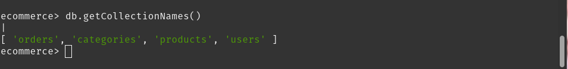

The output of `db.getCollectionNames()` confirms that all four collections — `orders`, `categories`, `products`, and `users` — were successfully created within the `ecommerce` database.

### 5.2 Sample Data Insertion

#### Users

Two customer documents were inserted representing users from different cities in Bhutan.

```javascript
db.users.insertMany([
  {
    name: "Tashi Dorji",
    email: "tashi@example.com",
    phone: "+975-17-123-456",
    address: { line1: "Building 12", city: "Thimphu", country: "Bhutan", postalCode: "11001" },
    createdAt: new Date("2026-04-18T08:00:00Z")
  },
  {
    name: "Sonam Choden",
    email: "sonam@example.com",
    phone: "+975-17-654-321",
    address: { line1: "Flat 3B", city: "Phuntsholing", country: "Bhutan", postalCode: "21001" },
    createdAt: new Date("2026-04-19T10:30:00Z")
  }
])
```

**Screenshot 2 — Users Collection (`db.users.find().pretty()`):**

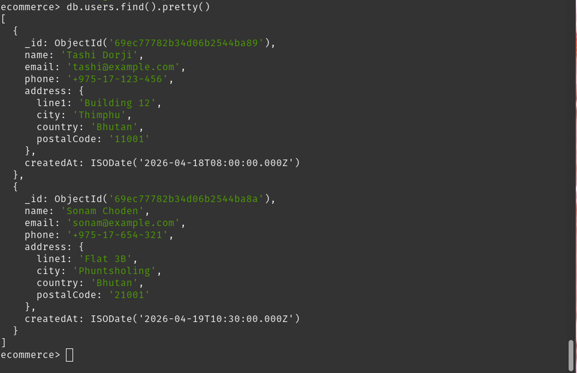

The `users` collection contains two documents. Each document features an embedded `address` sub-document — a deliberate design choice since address data is always retrieved alongside the user and is not shared across other documents.

#### Categories

Two category documents were inserted to establish a parent-child hierarchy.

```javascript
const electronicsId = ObjectId()
const accessoriesId = ObjectId()

db.categories.insertMany([
  { _id: electronicsId, name: "Electronics", slug: "electronics", parentCategoryId: null },
  { _id: accessoriesId, name: "Accessories", slug: "accessories", parentCategoryId: electronicsId }
])
```

**Screenshot 3 — Categories Collection (`db.categories.find().pretty()`):**

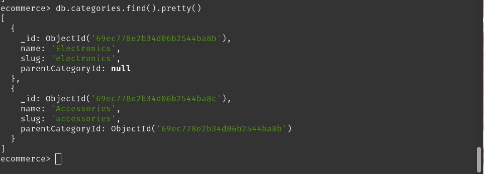

The "Electronics" category has `parentCategoryId: null`, identifying it as a root-level category. The "Accessories" category references the Electronics `_id` in its `parentCategoryId` field, establishing a hierarchical relationship between the two entries.

#### Products

Three product documents were inserted, demonstrating the Attribute Pattern across different product types.

```javascript
db.products.insertMany([
  {
    _id: headphonesId,
    name: "Wireless Bluetooth Headphones",
    categoryId: electronicsId,
    price: 129.99, currency: "USD", stock: 200,
    attributes: { brand: "Acme Audio", color: "black", wireless: true, batteryLifeHours: 24 },
    tags: ["audio", "wireless", "headphones"],
    createdAt: new Date("2026-04-18T10:00:00Z")
  },
  {
    _id: cableId,
    name: "USB-C Cable 1m",
    categoryId: accessoriesId,
    price: 9.99, currency: "USD", stock: 500,
    attributes: { brand: "Acme Tech", lengthMeters: 1, color: "white" },
    tags: ["cable", "usb-c"],
    createdAt: new Date("2026-04-18T11:00:00Z")
  },
  {
    _id: keyboardId,
    name: "Mechanical Keyboard",
    categoryId: electronicsId,
    price: 79.99, currency: "USD", stock: 150,
    attributes: { brand: "Acme Input", layout: "US", switchType: "blue", backlight: true },
    tags: ["keyboard", "mechanical", "backlit"],
    createdAt: new Date("2026-04-19T09:00:00Z")
  }
])
```

**Screenshot 4 — Products Collection (`db.products.find().pretty()`):**

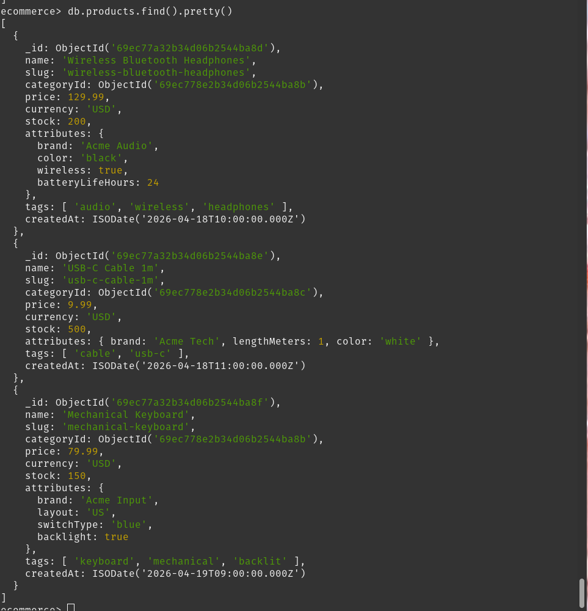

Three product documents are stored in the collection. The `attributes` sub-document differs structurally across product types — headphones carry `batteryLifeHours` and `wireless`, while the keyboard carries `switchType` and `backlight`. This heterogeneity is handled naturally by MongoDB's flexible document model without requiring any schema alteration.

---

#### Orders

Two order documents were inserted, each referencing a user and containing embedded line items.

```javascript
db.orders.insertMany([
  {
    userId: tashi._id,
    status: "PAID",
    items: [
      { productId: headphonesId, productName: "Wireless Bluetooth Headphones",
        unitPrice: 129.99, quantity: 2, lineTotal: 259.98 },
      { productId: cableId, productName: "USB-C Cable 1m",
        unitPrice: 9.99, quantity: 1, lineTotal: 9.99 }
    ],
    grandTotal: 269.97, currency: "USD",
    createdAt: new Date("2026-04-19T15:30:00Z"), paymentMethod: "CARD"
  },
  {
    userId: sonam._id,
    status: "PAID",
    items: [
      { productId: keyboardId, productName: "Mechanical Keyboard",
        unitPrice: 79.99, quantity: 1, lineTotal: 79.99 }
    ],
    grandTotal: 79.99, currency: "USD",
    createdAt: new Date("2026-04-20T09:15:00Z"), paymentMethod: "COD"
  }
])
```

**Screenshot 5 — Orders Collection (`db.orders.find().pretty()`):**

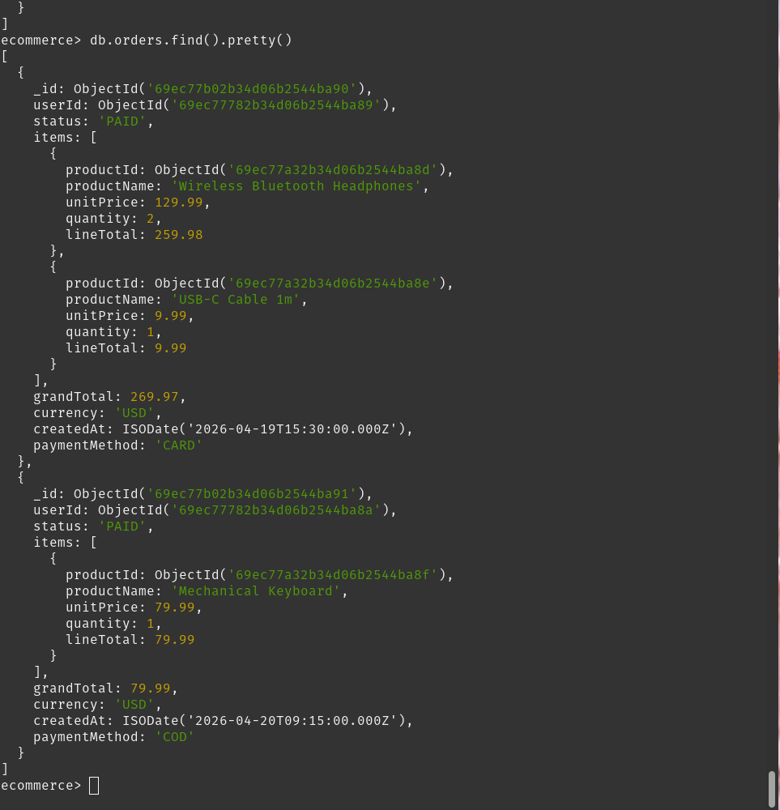

Two order documents are stored with embedded item arrays. The duplication of `productName` and `unitPrice` within each item is an intentional denormalization strategy. It ensures that each order document remains a faithful snapshot of the transaction at the time of purchase, unaffected by any subsequent changes to the product catalog.

## 6. Aggregation Framework Queries

Four aggregation pipelines were constructed and executed to address common e-commerce analytics requirements.

### 6.1 Query 1 — Daily Sales Totals

**Business Purpose:** To compute the total revenue generated and the number of orders placed on each calendar day, restricted to orders with a `status` of `PAID`.

**Pipeline Stages:** `$match` → `$group` → `$project` → `$sort`

```javascript
db.orders.aggregate([
  { $match: { status: "PAID" } },
  { $group: {
      _id: {
        year:  { $year:  "$createdAt" },
        month: { $month: "$createdAt" },
        day:   { $dayOfMonth: "$createdAt" }
      },
      totalRevenue: { $sum: "$grandTotal" },
      orderCount:   { $sum: 1 }
  }},
  { $project: {
      _id: 0,
      date: { $dateFromParts: {
        year: "$_id.year", month: "$_id.month", day: "$_id.day"
      }},
      totalRevenue: 1,
      orderCount: 1
  }},
  { $sort: { date: 1 } }
])
```

**Screenshot 6 — Query 1 Output:**

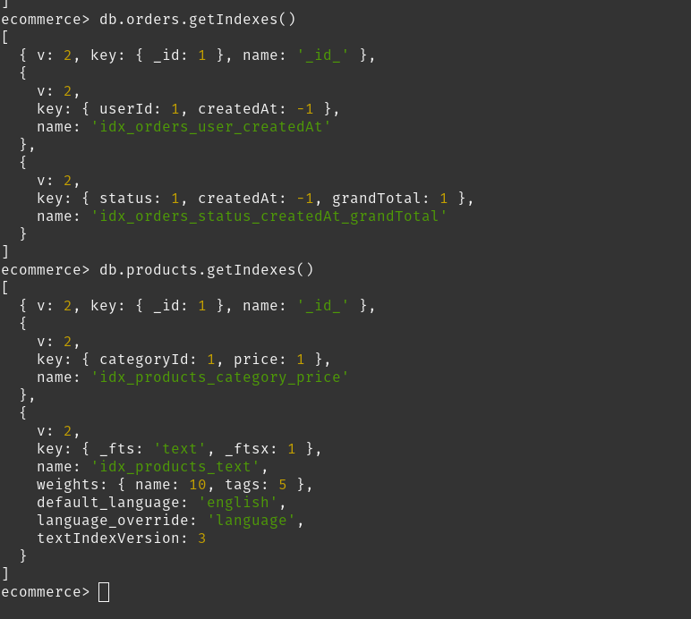

**Analysis:** The pipeline filtered orders to the PAID status, then grouped them by the date components extracted from `createdAt`. The `$dateFromParts` operator reconstructed a proper ISODate from the grouped year, month, and day values. The results confirm that April 19, 2026 recorded USD 269.97 in revenue from one order, and April 20, 2026 recorded USD 79.99 from one order — matching the inserted sample data exactly.

### 6.2 Query 2 — Top Products by Revenue

**Business Purpose:** To identify the highest-revenue-generating products across all paid orders, ranked in descending order of total revenue.

**Pipeline Stages:** `$match` → `$unwind` → `$group` → `$sort` → `$limit`

```javascript
db.orders.aggregate([
  { $match: { status: "PAID" } },
  { $unwind: "$items" },
  { $group: {
      _id:           "$items.productId",
      productName:   { $first: "$items.productName" },
      totalRevenue:  { $sum:  "$items.lineTotal" },
      totalQuantity: { $sum:  "$items.quantity" }
  }},
  { $sort: { totalRevenue: -1 } },
  { $limit: 5 }
])
```

**Screenshot 7 — Query 2 Output:**

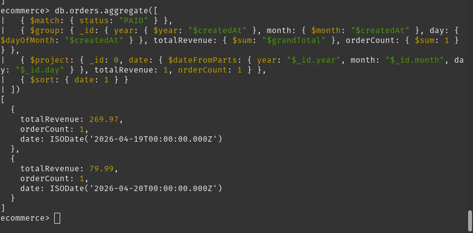

**Analysis:** The `$unwind` stage was critical in this pipeline — it deconstructed the embedded `items` array so that each individual line item became a separate document in the pipeline stream. Without this stage, grouping by `productId` would not be possible since items are stored as a nested array within order documents. The results rank Wireless Bluetooth Headphones first with USD 259.98 total revenue (2 units sold), followed by Mechanical Keyboard at USD 79.99 and USB-C Cable at USD 9.99.

### 6.3 Query 3 — Average Order Value per User

**Business Purpose:** To compute each customer's total number of orders, cumulative spend, and average order value, enriched with the customer's name retrieved from the `users` collection via a join.

**Pipeline Stages:** `$match` → `$group` → `$lookup` → `$unwind` → `$project` → `$sort`

```javascript
db.orders.aggregate([
  { $match: { status: "PAID" } },
  { $group: {
      _id:           "$userId",
      totalOrders:   { $sum: 1 },
      totalSpent:    { $sum: "$grandTotal" },
      avgOrderValue: { $avg: "$grandTotal" }
  }},
  { $lookup: {
      from:         "users",
      localField:   "_id",
      foreignField: "_id",
      as:           "user"
  }},
  { $unwind: "$user" },
  { $project: {
      _id: 0,
      userName:      "$user.name",
      totalOrders:   1,
      totalSpent:    1,
      avgOrderValue: 1
  }},
  { $sort: { totalSpent: -1 } }
])
```

**Screenshot 8 — Query 3 Output:**

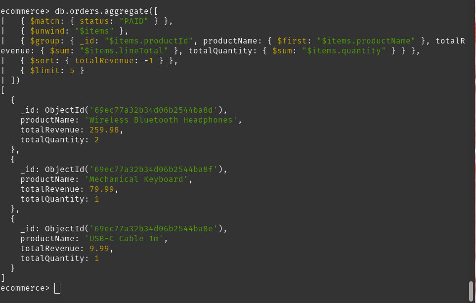

**Analysis:** The `$lookup` stage joined the `users` collection on the `userId` field, enabling customer names to be included in the aggregated output — the MongoDB equivalent of a SQL LEFT JOIN applied within an aggregation pipeline. The results show Tashi Dorji leading with USD 269.97 total spent across one order, followed by Sonam Choden with USD 79.99. Since each customer placed exactly one order in the sample data, the `avgOrderValue` equals the `totalSpent` in both records.

### 6.4 Query 4 — Product Catalog with Category Names

**Business Purpose:** To produce a complete product listing enriched with human-readable category names, suitable for display in a storefront catalog interface.

**Pipeline Stages:** `$lookup` → `$unwind` → `$project` → `$sort`

```javascript
db.products.aggregate([
  { $lookup: {
      from:         "categories",
      localField:   "categoryId",
      foreignField: "_id",
      as:           "category"
  }},
  { $unwind: "$category" },
  { $project: {
      _id: 0,
      name: 1,
      price: 1,
      "attributes.brand": 1,
      categoryName: "$category.name"
  }},
  { $sort: { categoryName: 1, name: 1 } }
])
```

**Screenshot 9 — Query 4 Output:**

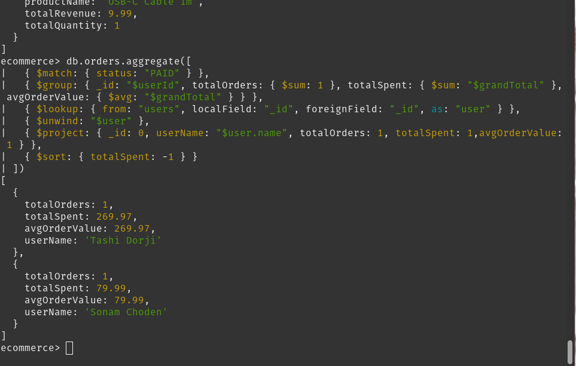

**Analysis:** The `$lookup` stage resolved the `categoryId` reference against the `categories` collection, replacing the raw ObjectId with a full category document. The `$project` stage then extracted only the `category.name` field, renamed as `categoryName`. The sorted output confirms that USB-C Cable is correctly classified under "Accessories", while Mechanical Keyboard and Wireless Bluetooth Headphones are both classified under "Electronics" — consistent with the category assignments made during data insertion.

## 7. Index Creation and Query Optimization

### 7.1 Indexes Created

Four indexes were created to support the collection's most critical query patterns.

```javascript
// Index 1: Orders by user and date — supports per-customer order history
db.orders.createIndex(
  { userId: 1, createdAt: -1 },
  { name: "idx_orders_user_createdAt" }
)

// Index 2: Orders by status, date, and total — ESR rule for reporting queries
db.orders.createIndex(
  { status: 1, createdAt: -1, grandTotal: 1 },
  { name: "idx_orders_status_createdAt_grandTotal" }
)

// Index 3: Products by category and price — supports product listing pages
db.products.createIndex(
  { categoryId: 1, price: 1 },
  { name: "idx_products_category_price" }
)

// Index 4: Weighted text index — supports full-text product search
db.products.createIndex(
  { name: "text", tags: "text" },
  { name: "idx_products_text", weights: { name: 10, tags: 5 } }
)
```

**Screenshot 10 — All Indexes on `orders` and `products` Collections:**

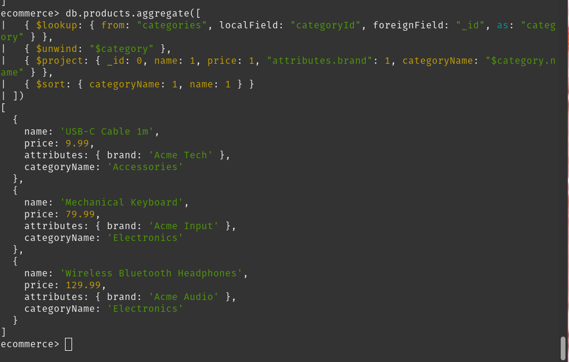

**Index Design Rationale:**

**idx_orders_user_createdAt** supports the query pattern of fetching a specific customer's recent orders sorted by date descending — one of the most common access patterns on an e-commerce order history page. The compound structure allows the query to resolve the equality constraint on `userId` first, then use the index order for sorting by `createdAt`.

**idx_orders_status_createdAt_grandTotal** follows the ESR rule precisely: `status` is the equality field, `createdAt` is the sort field, and `grandTotal` supports range-based filtering. This ordering maximizes index utilization for status-filtered date-range reporting queries.

**idx_products_category_price** supports the product listing page query, which filters by `categoryId` and sorts results by `price`. The compound field order ensures the equality constraint on `categoryId` is resolved first, followed by price-based sorting.

**idx_products_text** enables full-text search across product names and tags. The weight configuration assigns a score of 10 to the `name` field and 5 to the `tags` field, ensuring that documents matching the search term in their product name receive a higher relevance score than those matching only through their tags.

### 7.2 Query Performance Analysis with `explain()`

The following query was submitted to `explain("executionStats")` to analyze the execution plan and verify index utilization:

```javascript
db.orders.find(
  { status: "PAID", createdAt: { $gte: new Date("2026-04-19") } }
).sort({ createdAt: -1 }).explain("executionStats")
```

**Screenshot 11 — explain() Query Planner (winningPlan showing IXSCAN):**

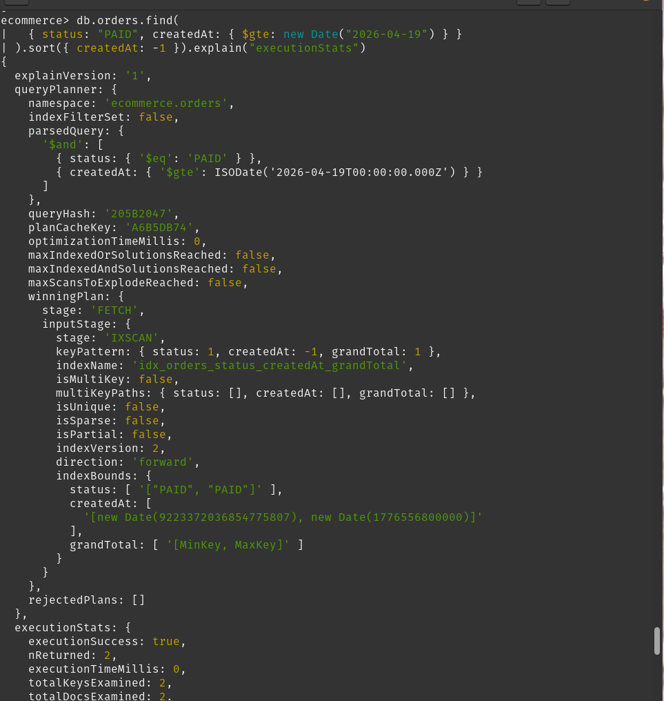

**Screenshot 12 — explain() Execution Statistics:**

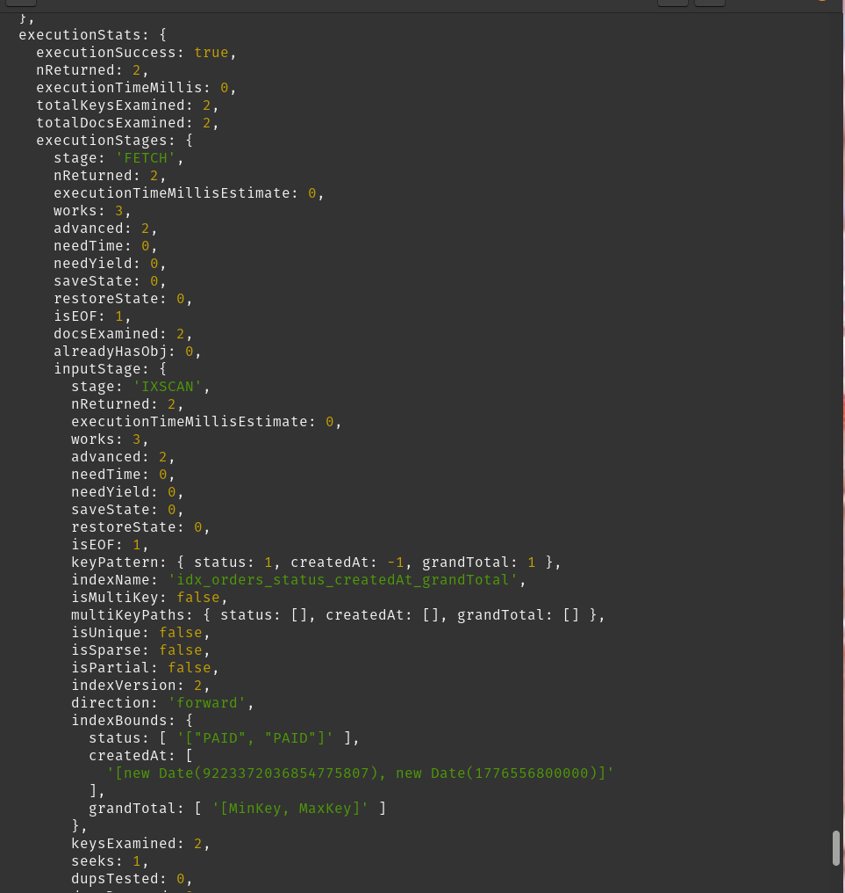

**Screenshot 13 — explain() Index Bounds and Server Info:**

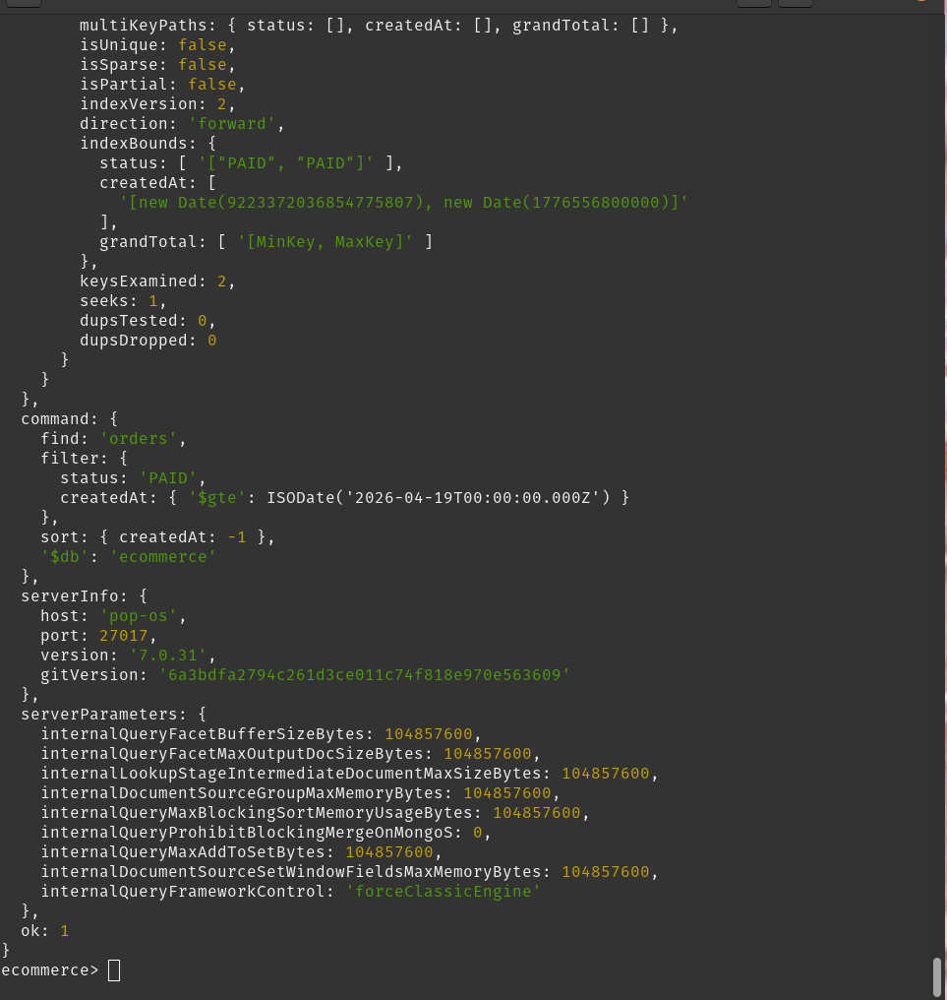


## 8. Discussion and Observations

The following observations were drawn from the implementation and testing conducted throughout this practical:

**On Schema Design:** The decision to embed order items within the order document proved effective for the primary read path. Order retrieval required a single document fetch with no join operation, which would not have been possible had items been stored in a separate collection. The intentional duplication of `productName` and `unitPrice` within each item correctly preserved historical purchase data, making the order record self-contained and independent of future catalog changes.

**On the `$unwind` Stage:** The necessity of `$unwind` in Query 2 highlights a fundamental characteristic of MongoDB aggregation — array fields must be deconstructed before they can be used as individual grouping keys. Without this stage, the pipeline would have grouped by the entire items array as a unit rather than by individual product entries, producing incorrect aggregated results.

**On Cross-Collection Joins via `$lookup`:** The `$lookup` stages in Queries 3 and 4 demonstrated that MongoDB's aggregation framework is capable of performing cross-collection joins functionally equivalent to SQL LEFT JOINs. However, since `$lookup` introduces additional latency, the schema was designed to minimize its use on the most frequent read paths by embedding commonly co-accessed data within the parent document.

**On the ESR Rule:** The compound index `idx_orders_status_createdAt_grandTotal` followed the ESR ordering by placing the equality field (`status`) first and the sort field (`createdAt`) second. This ordering allowed the index to serve both the filter and the sort simultaneously without requiring a separate in-memory sort step, as confirmed by the absence of a `SORT` stage in the `winningPlan` output.

**On Index Verification:** The `explain("executionStats")` output confirmed an `IXSCAN` with `executionTimeMillis: 0` and a 1:1 ratio of keys examined to documents returned. The `rejectedPlans: []` field further confirmed that no alternative plan was competitive, indicating that the index was uniquely well-suited for the query.

## 9. Conclusion

This practical successfully demonstrated the design, implementation, and optimization of a MongoDB schema for an e-commerce platform across four key areas.

In the area of **schema design**, four collections were structured following the query-first principle. Order items were embedded to optimize the primary read path and to preserve transactional history as an immutable snapshot. Categories, users, and product references were modeled using referencing to maintain consistency across shared entities.

In the area of **aggregation**, four analytical pipelines were constructed and executed, producing correct results for daily revenue reporting, product performance ranking, customer spending analysis, and enriched catalog generation. The pipelines made effective use of `$match`, `$group`, `$project`, `$lookup`, `$unwind`, `$sort`, and `$limit` stages to address realistic business analytics requirements.

In the area of **indexing**, four indexes were created and configured according to recognized best practices — including the ESR rule for compound indexes and field weighting for the text index. Each index was designed to align with a specific and common query pattern anticipated in a production e-commerce workload.

In the area of **query optimization**, the `explain("executionStats")` method confirmed that the query planner selected `IXSCAN` with an execution time of 0 milliseconds and a 1:1 ratio of index keys examined to documents returned, validating the correctness and efficiency of the index design.

The outcomes of this practical affirm that MongoDB, when combined with a query-driven schema design, a well-structured aggregation framework, and a disciplined indexing strategy, is well-suited for real-world e-commerce workloads that demand both data modeling flexibility and high query performance at scale.

